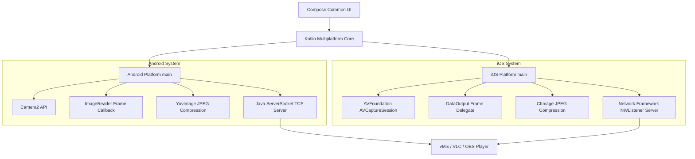

# System Architecture

This project is a Compose Multiplatform application designed to stream live mobile camera video directly over the local network using a lightweight HTTP-based MJPEG server.

## Architectural Overview



## Component Architecture

### 1. Common Main (KMP Core)
- **`App`**: Hosts routing and delegates state flows representing the streaming lifecycle.
- **`StreamConfig`**: Captures streaming preferences (resolution, framerate, server port, target server IP, client name) and converts them into connection URLs.
- **`StreamState`**: Sealed class managing states:
  - `Idle`: Camera is inactive.
  - `Previewing`: Local camera viewfinder is active.
  - `Streaming`: HTTP server is active and broadcasting frames.
  - `Error`: Holds failure messages for the UI.

---

### 2. iOS Native Architecture

- **`SwiftRtspStreamer.swift`**:
  - **Capture Pipeline**: Manages an `AVCaptureSession` feeding into `AVCaptureVideoDataOutput` and `AVCaptureVideoPreviewLayer`.
  - **Auto-Rotation**: Captures device rotation notifications, adjusting connection video orientations dynamically. Employs `CIImage.oriented()` to align captured frame pixels prior to JPEG conversion.
  - **HTTP Server**: Leverages Apple's native `Network` framework `NWListener` to serve multipart streams on the target port.
  - **Thread Safety**: Uses an `NSLock` mutex to prevent data races between asynchronous network queue callbacks (client connection/disconnections) and the background camera capture queue.

---

### 3. Android Native Architecture

- **`AndroidRtspStreamer.kt`**:
  - **Capture Pipeline**: Manages a native Android `Camera2` session mapping output streams to the local `TextureView` (viewfinder) and an `ImageReader` (processor).
  - **Auto-Rotation**: Resolves current window manager rotations against the back camera sensor orientation to rotate bitmaps before final compression.
  - **JPEG Engine**: Interleaves raw `YUV_420_888` buffers from `ImageReader` into `NV21` byte arrays, compressing them using `YuvImage.compressToJpeg()`.
  - **HTTP Server**: Implements a standard Java `ServerSocket` looping on a background thread pool, writing multipart HTTP headers and frame payloads to client sockets.

---

## MJPEG Over HTTP Data Flow

Both platforms conform to the standard MJPEG over HTTP specification:

1. **HTTP Headers**:
   ```http
   HTTP/1.1 200 OK
   Content-Type: multipart/x-mixed-replace; boundary=mjpegboundary
   Connection: keep-alive
   ```
2. **Multipart Frame Packets**:
   Every time the camera captures a frame (30fps), the JPEG bytes are broadcast to all connected sockets:
   ```http
   --mjpegboundary
   Content-Type: image/jpeg
   Content-Length: [bytes count]

   [JPEG Binary Data]
   ```
3. **Latency Characteristics**:
   - Because MJPEG streams consist of independent JPEG images without inter-frame dependencies (no I-frames/P-frames or decompression buffers), network latency is under **50ms** on typical local Wi-Fi.
